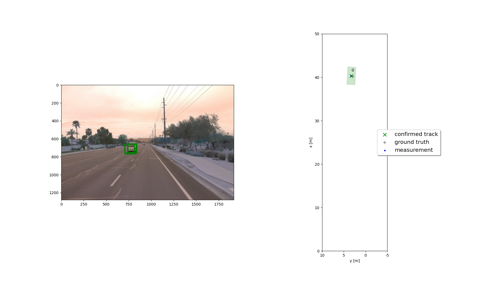
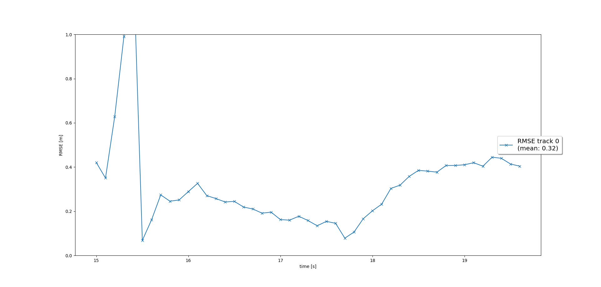
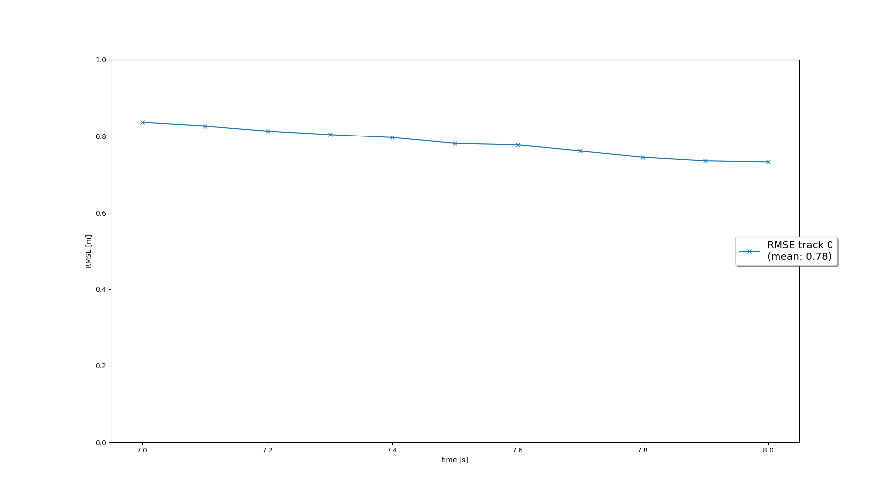
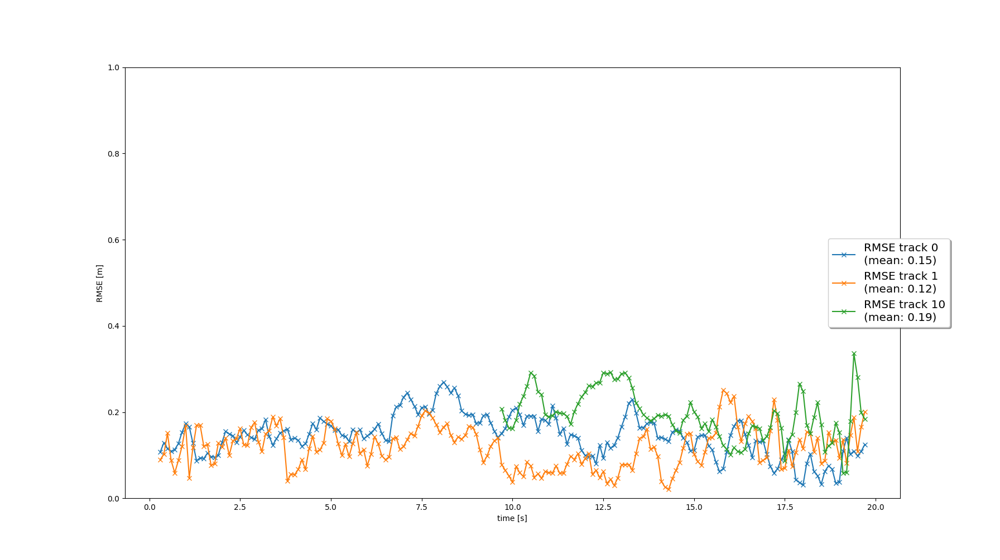
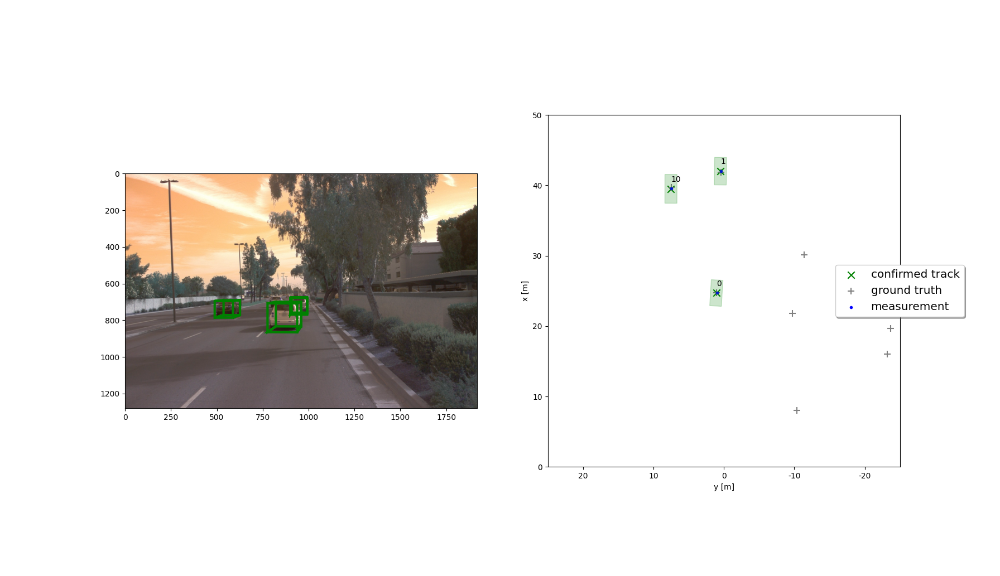
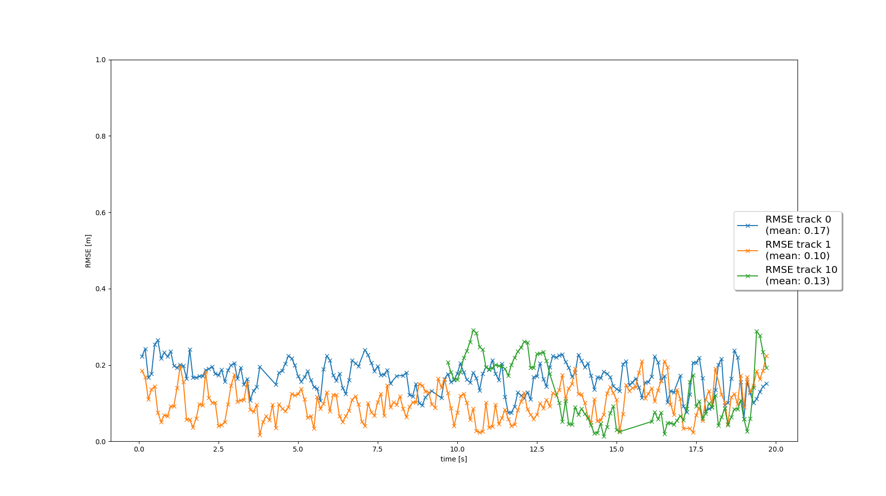

# Sensor Fusion and Tracking Final
This is the final project for the second course in the  [Udacity Self-Driving Car Engineer Nanodegree Program](https://www.udacity.com/course/c-plus-plus-nanodegree--nd213) : Sensor Fusion and Tracking. 

In this project, we have used the [Waymo Open Dataset's](https://console.cloud.google.com/storage/browser/waymo_open_dataset_v_1_2_0_individual_files) real-world data and applied Extended Kalman Filter to map and track multiple vehicles. This project consists of four major sections:

1. Implement an Extended Kalman Filter (EKF) to track an object 
2. Track managements: Initialize and delete tracks, set and update track  states and track scores
3. Implement and apply single nearest neighbor data association to associate measurements and tracks.
4. Sensor fusion of LiDAR measurement and camera measurement (nonlinear camera measurement model)


The project can be run by running 

```
python loop_over_dataset.py
```
All training/inference is done on "2019 16'' MacBook Pro (Intel)" machine.

## Project Recap and Results
### Section 1. Extended Kalman Filter
Implementation of EKF is in `student/filter.py`.
This section consists of the following steps
- Design system state `[x, y, z, vx, vy, vz]` in the constant velocity motion model in 3D
- Compute system matrix `F()` and system noise `Q` for constant velocity motion model in 3D <!-- TODO: time varying motion model -->
- Make predictions of track state `[x, y, z]` and estimation covariance `P`, based on `F()`, `Q()`; evaluate measurement function with `get_hx` and its Jacobian `get_H` and update the predictions with the Jacobian matrix `H` according to Kalman Filter update equations.

The results are as follows:  
- Single vehicle tracking results

- RMSE plot of state of one vehicle



### Section 2. Track Management
Implementation of track management is in `student/trackmanagement.py`. Here, we use a track list to handle several objects simultaneously.
This section consists of the following steps
- Initialize `track.x` and `track.P` based on unassigned measurement `meas`, which is transformed from sensor coordinate to vehicle coordinate; Initialize track state as `initialized` and track score as `1./params.window`
- For scores on one track, increase the track score if it is associated with a measurement, otherwise decrease the score. (See next section for track/measurement asscociation)
- Update track states to `tentative` or `confirmed` depending on the track scores
- Delete a track in the track list if its score is below some threshold or its estimation-error covariance `track.P` is too large

The results are as follows:  
- RMSE plot of state of one vehicle



<!-- TODO: SNN is implemented here, but there are other methods like Global Neasest Neighbor (GNN) and Probabilistic Data Association (PDA) -->
### Section 3. Data Association
Implementation of track management is in `student/association.py`.
This section consists of the following steps
- Construct association matrix by computing Mahalanobis distance between a track and a measurement 
- Exclude unlikely pairs by gating based on Chi-Square distribution
- Re-initialize the list of unassigned measurements `unassigned_meas` and unassigned tracks `unassigned_tracks`
- Find the minimum entry in `association_matrix`, delete corresponding row and column from the matrix
- Remove corresponding track and measurement from `unassigned_tracks` and `unassigned_meas`
- Return this association pair between track and measurement. If no more association was found, i.e. the minimum matrix entry is infinity, return `numpy.nan` for the track and measurement.

The results are as follows:  
- Three vehicles tracking results

- RMSE plot of state of three vehicles


### Section 4. Camera Sensor Fusion
Implementation of track management is in `student/measurements.py`. 
This section consists of the following steps:
- Initialize camera measurement objects using measurement vector `z` and covariance matrix of camera measurement noise `R`
- Apply nonlinear camera measurement function to transform state estimates in vehicle coordinates to image coordinates
- Use `in_fov` to check whether an object can be seen by this sensor; Reject track and measurement pair if `in_fov` returns `False`

The results are as follows:
(The detailed tracking process using LiDAR and camera measurements is recorded in the output video [`my_tracking_results.avi`](https://drive.google.com/file/d/1CKjVZorho2X6NoVZY3mcqd9GrWUbYzLA/view?usp=sharing))  
- Three vehicles tracking results

- RMSE plot of state of three vehicles
From the plot below, it is easy to see some improvements of the RMSE of track states, compared with the results in Section 3. This is expected, as camera measurement is added and used in sensor fusion with LiDAR measurement. 


## Conclusions
### 1. Most difficult part in the project
In general, all the tasks in the the major four steps are fair, given the exercises provided in class. However, integrating all of the them into one system requires hard work, patience and carefulness. One of the time-consuming tasks is camera sensor fusion with LiDAR. I originally used linear measurement to compute measurement-prediction residual, which turned out to result in huge Mahalanobis distances between tracks and camera measurements, and ended up with meaningless association matrices with all the entries being `np.nan`. I spent a large amount of time on debugging the code, and printing out all the intermediate steps, such as association matrices, generations of measurement data, track states and scores. Printing these intermedite steps really helped me find the fatal error in the very first step of constructing Extended Kalman Filter.

### 2. Benefits of sensor fusion
Different sensors for object detection have their pros and cons. For example, on one hand, 3D LiDAR offers more accurate measurement of distance of vehicles, which is lost in camera measurement due to 2D projection of 3D world. On the other hand, camera is the only sensor available to offer rich textured and color-based information such as speed sign, traffic lights, and etc.. LiDAR, however, cannot provide color and texture information.
Therefore, to achieve more precise and stable tracking results, an optimal algorithm should require sensor fusion of different sensors like LiDAR and camera, which takes advantages of the edges of all the different sensors and compensates for sensor failures and weaknesses.
As demonstrated in the results of **Section 3** and **Section 4**, tracking based on sensor fusion of camera and LiDAR, provides a more precise and stable tracking results than that with LiDAR-only tracking. 
### 3. Challenges
A sensor fusion system can face tremendous amount of challenges in real-life scenarios. In this project, the challenges can be categorized into following aspects:
- Performance of sensors: performances of both LiDAR and camera can be heavily deteriorated by extreme environmental conditions, like rain, heavy fog, darkness and etc.. We can consider add another different sensor into sensor fusion, like radar measurement to overcome extreme weather conditions. 
- Process noise: process noise can be different in different scenarios, such as large acceleration in emergency, and small acceleration in highway. Furthermore, the parameters for system noise are ad hoc and lacks support from real world data
- Complexity of the algorithms: the complexity for data association can increase as more vehicles are detected. In this project, gating method is applied to remove unlikely association pair of detected tracks and measurements to speed up the data association process to make prompt tracking.
- Visibility: each sensor in the sensor fusion systems, has a different field of view (fov), which leads to oscillating track scores. In this project, the front camera sensor has a more narrow fov than LiDAR. A method `in_fov` is implemented to check whether tracks updated by LiDAR measurement lie outside the fov of the front camera.


### 4. Future Directions for Improvement
In the future, there are several directions for improvement over the current sensor fusion and tracking system:
1. A motion model with varying elapsed time between measurements can substitute the current model with constant elapsed time to give more accurate predictions. 
2. Adapt the Kalman filter to also estimate the object's width, length, and height, instead of simply using the unfiltered lidar detections as in this project.
3. Use a non-linear motion model, e.g. a bicycle model, which is more appropriate for vehicle movement than our linear motion model, since a vehicle can only move forward or backward, not in any direction.
4. Fine tune the parameters: e.g. apply the standard deviation values for lidar, which can be obtained from the 3D object detection in the midterm project, to parameters in the system noise `Q`.
5. A more accurate camera detections from the Project 1 <!-- TODO: add link --> can be used to replace the current camera detections in the tracking.  
6. A more advanced data association algorithm, e.g. Global Nearest Neighbor (GNN) or Joint Probabilistic Data Association (JPDA), can substitute the simplest Single Nearest Neighbor (SNN)
