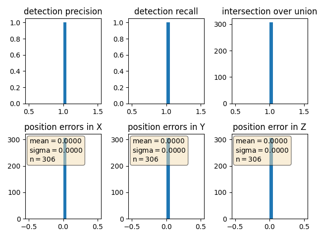

# Sensor Fusion and Tracking Midterm 

This is the midterm project for the second course in the  [Udacity Self-Driving Car Engineer Nanodegree Program](https://www.udacity.com/course/c-plus-plus-nanodegree--nd213) : Sensor Fusion and Tracking. 


## 3D Object detection

We have used the [Waymo Open Dataset's](https://console.cloud.google.com/storage/browser/waymo_open_dataset_v_1_2_0_individual_files) real-world data and used 3d point cloud for lidar based object detection. 

- Configuring the ranges channel to 8 bit and view the range /intensity image (ID_S1_EX1)
- Use the Open3D library to display the lidar point cloud on a 3d viewer and identifying 10 images from point cloud.(ID_S1_EX2)
- Create Birds Eye View perspective (BEV) of the point cloud, assign lidar intensity values to BEV, normalize the height map of each BEV (ID_S2_EX1,ID_S2_EX2,ID_S2_EX3)
- In addition to YOLO, use the [repository](https://review.udacity.com/github.com/maudzung/SFA3D) and add parameters ,instantiate fpn resnet model(ID_S3_EX1)
- Convert BEV coordinates into pixel coordinates and convert model output to bounding box format  (ID_S3_EX2)
- Compute intersection over union, assign detected objects to label if IOU exceeds threshold (ID_S4_EX1)
- Compute false positives and false negatives, precision and recall(ID_S4_EX2,ID_S4_EX3)


The project can be run by running 

```
python loop_over_dataset.py
```
All training/inference is done on "2019 16'' MacBook Pro (Intel)" machine.

## Section 1: Compute Lidar Point-Cloud from Range Image
There are 2 steps in this section:
1. Visualize range image channels (ID_S1_EX1)
2. Visualize lidar point-cloud (ID_S1_EX2)

### Step 1: Visualize range image channels (ID_S1_EX1)
We first preview the range image and convert the `range` channel and `intensity` channel to 8-bit integer format. Then we OpenCV library to stack the range and intensity image vertically and visualize it.

Settings in `loop_over_dataset.py`:
```
data_filename = 'training_segment-1005081002024129653_5313_150_5333_150_with_camera_labels.tfrecord'
show_only_frames = [0, 1]
exec_data = []
exec_detection = []
exec_tracking = []
exec_visualization = ['show_range_image']
```

Implmentation of the function `show_range_image` in `student/object_pcl.py`:
```
def show_range_image(frame, lidar_name):

    ####### ID_S1_EX1 START #######     
    #######
    print("student task ID_S1_EX1")

    # step 1 : extract lidar data and range image for the roof-mounted lidar
    lidar = [obj for obj in frame.lasers if obj.name == lidar_name][0] # get laser data structure from frame
    
    # step 2 : extract the range and the intensity channel from the range image
    ri = []
    if len(lidar.ri_return1.range_image_compressed) > 0: # use first response
        ri = dataset_pb2.MatrixFloat()
        ri.ParseFromString(zlib.decompress(lidar.ri_return1.range_image_compressed))
        ri = np.array(ri.data).reshape(ri.shape.dims)

    # step 3 : set values <0 to zero
    ri[ri<0] = 0.0

    # step 4 : map the range channel onto an 8-bit scale and make sure that the full range of values is appropriately considered
    ri_range = ri[:,:,0]
    ri_range = ri_range * 255 / (np.amax(ri_range) - np.amin(ri_range))
    img_range = ri_range.astype(np.uint8)
    
    # step 5 : map the intensity channel onto an 8-bit scale and normalize with the difference between the 1- and 99-percentile to mitigate the influence of outliers
    ri_intensity = ri[:,:,1]
    percentile_1, percentile_99 = percentile(ri_intensity,1), percentile(ri_intensity,99)
    ri_intensity = 255 * np.clip(ri_intensity, percentile_1, percentile_99) / (percentile_99 - percentile_1)
    img_intensity = ri_intensity.astype(np.uint8)

    # step 6 : stack the range and intensity image vertically using np.vstack and convert the result to an unsigned 8-bit integer
    img_range_intensity = np.vstack((img_range, img_intensity))
    img_range_intensity = img_range_intensity.astype(np.uint8)

    # Crop range image to +/- 90 deg. left and right of the forward-facing x-axis
    deg90 = int(img_range_intensity.shape[1]/4)
    ri_center = int(img_range_intensity.shape[1]/2)
    img_range_intensity = img_range_intensity[:, ri_center-deg90:ri_center+deg90]
    
    # img_range_intensity = [] # remove after implementing all steps
    #######
    ####### ID_S1_EX1 END #######     
    
    return img_range_intensity
```
A sample of range image and intensity image obtained by function `show_range_image`:


### Step 2: Visualize lidar point-cloud (ID_S1_EX2)
In this step, we use Open3D library to display the lidar point-cloud in a 3d viewer.

Settings in `loop_over_dataset.py`:
```
data_filename = 'training_segment-10963653239323173269_1924_000_1944_000_with_camera_labels.tfrecord'
show_only_frames = [0, 20]
exec_data = []
exec_detection = []
exec_tracking = []
exec_visualization = ['show_pcl']
```

Implmentation of the function `show_pcl` in `student/object_pcl.py`:
```
def show_pcl(pcl):

    ####### ID_S1_EX2 START #######     
    #######
    print("student task ID_S1_EX2")

    # step 1 : initialize open3d with key callback and create window
    vis_pcl = o3d.visualization.VisualizerWithKeyCallback()
    vis_pcl.create_window(window_name='Open3D', width=1280, height=1080, left=50, top=50, visible=True)

    global idx
    idx = True
    def right_click(vis_pcl):
        global idx
        print('right arrow pressed')
        idx = False
        return
    vis_pcl.register_key_callback(262, right_click)

    # step 2 : create instance of open3d point-cloud class
    pcd = o3d.geometry.PointCloud()

    # step 3 : set points in pcd instance by converting the point-cloud into 3d vectors (using open3d function Vector3dVector)
    pcd.points = o3d.utility.Vector3dVector(pcl[:, :3])

    # step 4 : for the first frame, add the pcd instance to visualization using add_geometry; for all other frames, use update_geometry instead
    vis_pcl.add_geometry(pcd)
    
    # step 5 : visualize point cloud and keep window open until right-arrow is pressed (key-code 262)
    while idx:
        vis_pcl.poll_events()
        vis_pcl.update_renderer()
    #######
    ####### ID_S1_EX2 END #######     
```
From the obtained point cloud images below, we can conclude some stable features of most vehicles
1. Bird-Eye-View shape
    
2. Rear bumper shapes
    
3. Side mirror shapes
    
4. Side view shape
    
5. Tire shape
    
6. Wind shield shape
    
From all of these pictures, we can see the chassis of cars are the most identifiable feature of almost all cars with good visibility.
We can also see that vehicles have varying visibility. Vehicles at appropriate close distance have better visibility than vehicles at far distance.

## Section 2: Create Birds-Eye View from Lidar PCL
There are 3 steps in this section:
1. Convert sensor coordinates to bev-map coordinates (ID_S2_EX1)
2. Compute intensity layer of bev-map (ID_S2_EX2)
3. Compute height layer of bev-map (ID_S2_EX3)

Settings in `loop_over_dataset.py` for all three steps above:
```
data_filename = 'training_segment-1005081002024129653_5313_150_5333_150_with_camera_labels.tfrecord'
show_only_frames = [0, 1]
exec_data = ['pcl_from_rangeimage']
exec_detection = ['bev_from_pcl']
exec_tracking = []
exec_visualization = []
```

### Step 1: Convert sensor coordinates to bev-map coordinates (ID_S2_EX1)

Implmentation of Step 1 in the function `bev_from_pcl` in `student/object_pcl.py`:
```
def bev_from_pcl(lidar_pcl, configs):

    # remove lidar points outside detection area and with too low reflectivity
    mask = np.where((lidar_pcl[:, 0] >= configs.lim_x[0]) & (lidar_pcl[:, 0] <= configs.lim_x[1]) &
                    (lidar_pcl[:, 1] >= configs.lim_y[0]) & (lidar_pcl[:, 1] <= configs.lim_y[1]) &
                    (lidar_pcl[:, 2] >= configs.lim_z[0]) & (lidar_pcl[:, 2] <= configs.lim_z[1]))
    lidar_pcl = lidar_pcl[mask]
    
    # shift level of ground plane to avoid flipping from 0 to 255 for neighboring pixels
    lidar_pcl[:, 2] = lidar_pcl[:, 2] - configs.lim_z[0]  

    # convert sensor coordinates to bev-map coordinates (center is bottom-middle)
    ####### ID_S2_EX1 START #######     
    #######
    print("student task ID_S2_EX1")

    ## step 1 :  compute bev-map discretization by dividing x-range by the bev-image height (see configs)
    bev_discret = (configs.lim_x[1] - configs.lim_x[0]) / configs.bev_height

    ## step 2 : create a copy of the lidar pcl and transform all metrix x-coordinates into bev-image coordinates    
    lidar_pcl_cpy = np.copy(lidar_pcl)
    lidar_pcl_cpy[:, 0] = np.int_(np.floor(lidar_pcl_cpy[:, 0]/bev_discret))

    # step 3 : perform the same operation as in step 2 for the y-coordinates but make sure that no negative bev-coordinates occur
    lidar_pcl_cpy[:, 1] = np.int_(np.floor(lidar_pcl_cpy[:, 1]/bev_discret) + (configs.bev_width+1)/2)
    lidar_pcl_cpy[:, 1] = np.abs(lidar_pcl_cpy[:, 1])

    # step 4 : visualize point-cloud using the function show_pcl from a previous task
    show_pcl(lidar_pcl_cpy)
    
    #######
    ####### ID_S2_EX1 END #######     
```
The result is:<!-- TODO: -->


### Step 2: Compute intensity layer of bev-map (ID_S2_EX2)
Implmentation of Step 2 in the function `bev_from_pcl` in `student/object_pcl.py`:
```
    ####### ID_S2_EX2 START #######     
    #######
    print("student task ID_S2_EX2")

    ## step 1 : create a numpy array filled with zeros which has the same dimensions as the BEV map
    intensity_map = np.zeros((configs.bev_height, configs.bev_width))

    # step 2 : re-arrange elements in lidar_pcl_cpy by sorting first by x, then y, then -z (use numpy.lexsort)
    lidar_pcl_cpy[lidar_pcl_cpy[:, 3]>1.0, 3] = 1.0
    idx_height = np.lexsort((-lidar_pcl_cpy[:, 2], lidar_pcl_cpy[:, 1], lidar_pcl_cpy[:, 0]))
    lidar_pcl_top = lidar_pcl_cpy[idx_height]

    ## step 3 : extract all points with identical x and y such that only the top-most z-coordinate is kept (use numpy.unique)
    ##          also, store the number of points per x,y-cell in a variable named "counts" for use in the next task
    _, indices, counts = np.unique(lidar_pcl_cpy[:, 0:2], axis=0, return_index=True, return_counts=True)
    lidar_pcl_top = lidar_pcl_cpy[indices]

    ## step 4 : assign the intensity value of each unique entry in lidar_top_pcl to the intensity map 
    ##          make sure that the intensity is scaled in such a way that objects of interest (e.g. vehicles) are clearly visible    
    ##          also, make sure that the influence of outliers is mitigated by normalizing intensity on the difference between the max. and min. value within the point cloud
    intensity_map[np.int_(lidar_pcl_top[:, 0]), 
                np.int_(lidar_pcl_top[:, 1])] = lidar_pcl_top[:, 3]/(np.amax(lidar_pcl_top[:, 3]) - np.amin(lidar_pcl_top[:, 3]))


    ## step 5 : temporarily visualize the intensity map using OpenCV to make sure that vehicles separate well from the background
    img_intensity = intensity_map * 256
    img_intensity = img_intensity.astype(np.uint8)
    cv2.imshow('intensity_map', img_intensity)
    cv2.waitKey(0)
    cv2.destroyAllWindows()

    #######
    ####### ID_S2_EX2 END ####### 
```
The result is:<!-- TODO: -->


### Step 3: Compute height layer of bev-map (ID_S2_EX3)
Implmentation of Step 3 in the function `bev_from_pcl` in `student/object_pcl.py`:
```
    ####### ID_S2_EX3 START #######     
    #######
    print("student task ID_S2_EX3")

    ## step 1 : create a numpy array filled with zeros which has the same dimensions as the BEV map
    height_map = np.zeros((configs.bev_height, configs.bev_width))

    ## step 2 : assign the height value of each unique entry in lidar_top_pcl to the height map 
    ##          make sure that each entry is normalized on the difference between the upper and lower height defined in the config file
    ##          use the lidar_pcl_top data structure from the previous task to access the pixels of the height_map
    height_map[np.int_(lidar_pcl_top[:, 0]), 
            np.int_(lidar_pcl_top[:, 1])] = lidar_pcl_top[:, 2] / np.float(np.abs(configs.lim_z[1] - configs.lim_z[0]))


    ## step 3 : temporarily visualize the intensity map using OpenCV to make sure that vehicles separate well from the background
    img_height = height_map * 256
    img_height = img_height.astype(np.uint8)
    cv2.imshow('height_map', img_height)
    cv2.waitKey(0)
    cv2.destroyAllWindows()

    #######
    ####### ID_S2_EX3 END #######
```
The result is:<!-- TODO: -->


## Section 3: Model-based Object Detection in BEV Image
There are 2 steps in this section:
1. Add a second model from a GitHub repo (ID_S3_EX1)
2. Extract 3D bounding boxes from model response (ID_S3_EX2)

Settings in `loop_over_dataset.py` for both steps above:
```
configs_det = det.load_configs(model_name="fpn_resnet")

data_filename = 'training_segment-1005081002024129653_5313_150_5333_150_with_camera_labels.tfrecord'
show_only_frames = [50, 51]
exec_data = ['pcl_from_rangeimage, 'load_image']
exec_detection = ['bev_from_pcl', 'detect_objects']
exec_tracking = []
exec_visualization = ['show_objects_in_bev_labels_in_camera']
```
### Step 1: Add a second model from a GitHub repo (ID_S3_EX1)
Implmentation of Step 1 in the function `detect_objects`, `load_configs_model`, `create_model` in `student/object_detect.py`:
- Extract relevant parameters from [SFA3D](https://github.com/maudzung/SFA3D), and add them to `load_configs_model`:
    ```
    elif model_name == 'fpn_resnet':
        ####### ID_S3_EX1-3 START #######     
        #######
        print("student task ID_S3_EX1-3")
        configs.saved_fn = 'fpn_resnet'
        configs.arch = 'fpn_resnet'
        configs.model_path = os.path.join(parent_path, 'tools', 'objdet_models', 'resnet')
        configs.pretrained_filename = os.path.join(configs.model_path, 'pretrained', 'fpn_resnet_18_epoch_300.pth')
        configs.pretrained_path = os.path.join(configs.model_path, 'pretrained', 'fpn_resnet_18_epoch_300.pth')
        configs.k = 50
        configs.conf_thresh = 50
        configs.no_cuda = False
        configs.gpu_idx = 0
        configs.num_samples = None
        configs.num_workers = 1
        configs.batch_size = 1
        configs.peak_thresh = 0.2
        configs.save_test_output = False
        configs.output_format = 'image'
        configs.output_video_fn = 'out_fpn_resnet_18'
        configs.output_width = 608
        configs.pin_memory = True
        configs.distributed = False  # For testing on 1 GPU only
        configs.input_size = (608, 608)
        configs.hm_size = (152, 152)
        configs.down_ratio = 4
        configs.max_objects = 50
        configs.imagenet_pretrained = False
        configs.head_conv = 64
        configs.num_classes = 3
        configs.num_center_offset = 2
        configs.num_z = 1
        configs.num_dim = 3
        configs.num_direction = 2
        configs.heads = {
            'hm_cen': configs.num_classes,
            'cen_offset': configs.num_center_offset,
            'direction': configs.num_direction,
            'z_coor': configs.num_z,
            'dim': configs.num_dim
        }
        configs.num_input_features = 4
        #######
        ####### ID_S3_EX1-3 END #######     
    ```


- Instantiate the model for `fpn_resnet` in `create_model`, with configs loaded using `load_configs_model`:
    ```
    ####### ID_S3_EX1-4 START #######     
    #######
    print("student task ID_S3_EX1-4")
    num_layers = 18
    model = fpn_resnet.get_pose_net(num_layers=num_layers, heads=configs.heads,
                                    head_conv=configs.head_conv,
                                    imagenet_pretrained=configs.imagenet_pretrained)
    #######
    ####### ID_S3_EX1-4 END #######     
    ```

- Perform inference, decode the output and perform post-processing in `detect_objects`:
    ```
    elif 'fpn_resnet' in configs.arch:
    # decode output and perform post-processing
    
    ####### ID_S3_EX1-5 START #######     
    #######
    print("student task ID_S3_EX1-5")
    outputs['hm_cen'] = _sigmoid(outputs['hm_cen'])
    outputs['cen_offset'] = _sigmoid(outputs['cen_offset'])
    # detections size (batch_size, K, 10)
    detections = decode(outputs['hm_cen'], outputs['cen_offset'], outputs['direction'], outputs['z_coor'],
                        outputs['dim'], K=configs.k)
    detections = detections.cpu().numpy().astype(np.float32)
    detections = post_processing(detections, configs)
    detections = detections[0][1]
    print(detections)

    #######
    ####### ID_S3_EX1-5 END #######    
    ```

### Step 2: Extract 3D bounding boxes from model response (ID_S3_EX2)
- Visualize the results by setting the flag `show_objects_in_bev_labels_in_camera`:
Since the objects detected by the model are in BEV coordinates, we need to convert them into real vehicle space before visualization
    ```
    ####### ID_S3_EX2 START #######     
    #######
    # Extract 3d bounding boxes from model response
    print("student task ID_S3_EX2")
    objects = [] 

    ## step 1 : check whether there are any detections
    for obj in detections:
        id, bev_x, bev_y, z, h, bev_w, bev_l, yaw = obj

        ## step 2 : loop over all detections
        x = bev_y / configs.bev_height * (configs.lim_x[1] - configs.lim_x[0])
        y = bev_x / configs.bev_height * (configs.lim_y[1] - configs.lim_y[0]) - (configs.lim_y[1] - configs.lim_y[0])/2.0 
        w = bev_w / configs.bev_height * (configs.lim_y[1] - configs.lim_y[0])
        l = bev_l / configs.bev_height * (configs.lim_x[1] - configs.lim_x[0])
        
            ## step 3 : perform the conversion using the limits for x, y and z set in the configs structure
        if ((x >= configs.lim_x[0]) and (x <= configs.lim_x[1]) and
            (y >= configs.lim_y[0]) and (y <= configs.lim_y[1]) and
            (z >= configs.lim_z[0]) and (z <= configs.lim_z[1])):
            ## step 4 : append the current object to the 'objects' array
            objects.append([1, x, y, z, h, w, l, yaw])
        
    #######
    ####### ID_S3_EX2 START #######
    ```
The result is:<!-- TODO: -->


## Section 4 : Performance Evaluation for Object Detection
There are 3 steps in this section:
1. Compute intersection-over-union (IOU) between labels and detections (ID_S4_EX1)
2. Compute false-negatives and false-positives (ID_S4_EX2)
3. Compute precision and recall (ID_S4_EX3)

Settings in `loop_over_dataset.py` for all three steps above:
```
configs_det = det.load_configs(model_name="darknet")

data_filename = 'training_segment-1005081002024129653_5313_150_5333_150_with_camera_labels.tfrecord'
show_only_frames = [50, 150]
exec_data = ['pcl_from_rangeimage]
exec_detection = ['bev_from_pcl', 'detect_objects', 'validate_object_labels', 'measure_detection_performance']
exec_tracking = []
exec_visualization = ['show_detection_performance']
```
**Note**: Turn off the visualization in **Section 1** before inference.
### Step 1: Compute intersection-over-union (IOU) between labels and detections (ID_S4_EX1)
Implmentation of Step 1 in the function `measure_detection_performance` in `student/object_eval.py`:
```
# compute intersection over union (iou) and distance between centers

    ####### ID_S4_EX1 START #######     
    #######
    print("student task ID_S4_EX1 ")

    ## step 1 : extract the four corners of the current label bounding-box
    box = label.box
    box_gt = tools.compute_box_corners(box.center_x, box.center_y, box.width, box.length, box.heading)
    ## step 2 : loop over all detected objects
    for detection in detections:
        ## step 3 : extract the four corners of the current detection
        _id, bev_x, bev_y, z, _h, bev_w, bev_l, yaw = detection
        box_det = tools.compute_box_corners(bev_x, bev_y, bev_w, bev_l, yaw)
        ## step 4 : computer the center distance between label and detection bounding-box in x, y, and z
        dist_x = np.array(box.center_x - bev_x).item()
        dist_y = np.array(box.center_y - bev_y).item()
        dist_z = np.array(box.center_z - z).item()
        ## step 5 : compute the intersection over union (IOU) between label and detection bounding-box
        poly_gt = Polygon(box_gt)
        poly_det = Polygon(box_det)
        intersection = poly_gt.intersection(poly_det).area
        union = poly_gt.union(poly_det).area
        iou = intersection/union
        ## step 6 : if IOU exceeds min_iou threshold, store [iou,dist_x, dist_y, dist_z] in matches_lab_det and increase the TP count
        if iou > min_iou:
            matches_lab_det.append([iou, dist_x, dist_y, dist_z])
    #######
    ####### ID_S4_EX1 END #######     
```

### Step 2: Compute false-negatives and false-positives (ID_S4_EX2)
Implmentation of Step 2 in the function `measure_detection_performance` in `student/object_eval.py`:
```
####### ID_S4_EX2 START #######     
#######
print("student task ID_S4_EX2")

# compute positives and negatives for precision/recall

## step 1 : compute the total number of positives present in the scene
all_positives = labels_valid.sum()

## step 2 : compute the number of false negatives
true_positives = len(ious)
false_negatives = all_positives - true_positives

## step 3 : compute the number of false positives
false_positives = len(detections) - true_positives

#######
####### ID_S4_EX2 END #######     
```

### Step 3: Compute precision and recall (ID_S4_EX3)
Implmentation of Step 3 in the function `compute_performance_stats` in `student/object_eval.py`:
```
####### ID_S4_EX3 START #######     
#######    
print('student task ID_S4_EX3')

## step 1 : extract the total number of positives, true positives, false negatives and false positives
pos_negs = []
for item in det_performance_all:
    pos_negs.append(item[2])
pos_negs_arr = np.asarray(pos_negs)

positives = sum(pos_negs_arr[:, 0])
true_positives = sum(pos_negs_arr[:, 1])
false_negatives = sum(pos_negs_arr[:, 2])
false_positives = sum(pos_negs_arr[:, 3])
## step 2 : compute precision
precision = true_positives/float(true_positives + false_positives)

## step 3 : compute recall 
recall = true_positives/float(true_positives + false_negatives)

#######    
####### ID_S4_EX3 END #######     
```
To check if the code will produce plausible results, set the flag `configs_det.use_labels_as_objects = True`. The precision and recall results below are the same as expected:
`precision = 1.0, recall = 1.0`
<!-- TODO: -->


`darknet` gives a result with `precision = 0.9506578947368421, recall = 0.9444444444444444` and the following precision-recall curve


`fpn_resnet` gives a result with `precision = 0.9782608695652174, recall = 0.8823529411764706` and the following precision-recall curve


**Interpretation** By comparing the inference results from `darknet` and 'fpn_resnet', we can see that `resnet` is more precise, i.e. when a detection is made, `resnet` has a higher possibility that its detection is correct, than 'darknet'. However, `resnet` also has higher possibility missing vehicles than `darknet`.

## Summary
From this project, it is clear that LiDAR is effective and should be used for object detection. LiDAR offers more perspectives and information from higher dimensional spaces. The conversion of range data to point clouds are important for further analysis.In 3D object detection, there are two essential steps: we first convert high-dimensional LiDAR point cloud to points in Bird-Eye-View coordinates; then we apply **resnet** and **YOLO** to convert high-dimensional LiDAR point cloud to object detection through bounding boxes. Finally, we evaluate the performance with maximal IOU mapping, mAP, and representing the precision/recall rate of the bounding boxes. These evaluations are essential to understand the effectiveness of LiDAR based object detections.